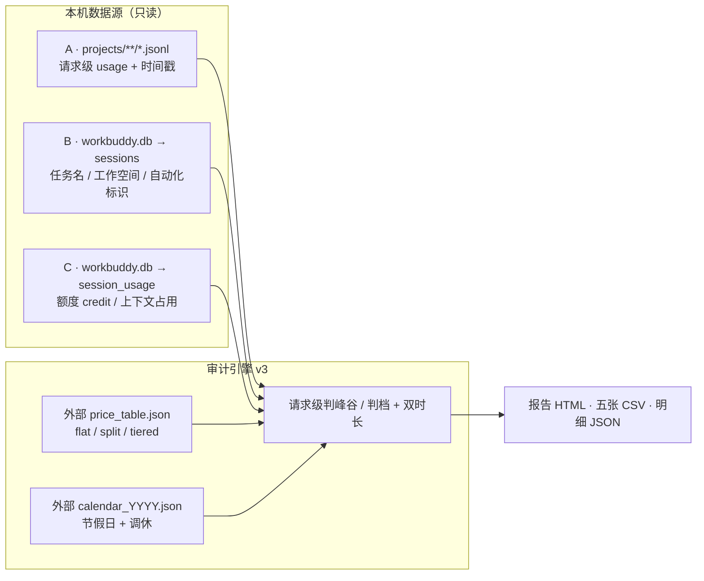
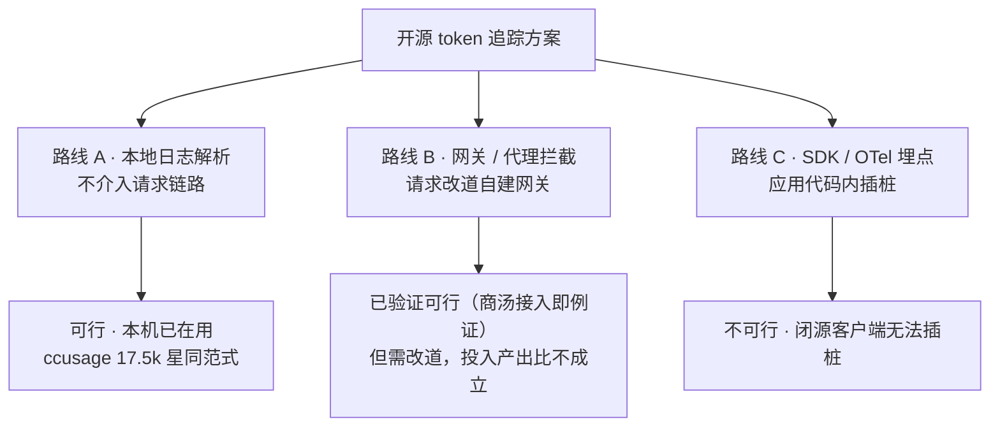

# WorkBuddy 任务级 Token 消耗追溯
### 开源方案调研 + 本机实测 + 分时计价修订

> 版本 v3　|　生成 2026-09-20 19:22:31　|　数据范围 2026-07-27 ~ 2026-09-20（24 天）
> 数据来源：本机 `~/.workbuddy` 的 JSONL 会话日志与 SQLite 数据库，全程只读，无任何数据外发。

---

## 0. 结论先行

| # | 结论 | 依据 |
|---|---|---|
| **1** | **你的需求不需要引入任何开源方案** | 本机已落盘 11,568 条请求级真实 usage，含 token 与请求时间戳 |
| **2** | **分时计价必要**：一刀切按高峰价会多算 ¥0.66（0.16%） | DeepSeek 系高峰价 = 空闲价 × 2；1 个任务横跨峰谷 |
| **3** | **法定节假日与调休必须显式建模** | 2026-09-20（周日）是国庆调休上班日，按休息日处理会全天误判为空闲 |
| **4** | **三类开源方案中只有"本地日志解析"零代价可用** | SDK 埋点路线对闭源客户端不可行；网关代理路线已验证可行但需改道请求 |

### 核心数字（实测）

| 指标 | 实测值 |
|---|---|
| 累计 token | **13.58 亿** |
| 分时口径成本 | **¥403.46**（日均 ¥16.81） |
| 对照：全按高峰价 | ¥404.12 |
| 对照：全按空闲价 | ¥395.89 |
| 任务会话 / 请求 | 30 / 11,568 |
| 缓存命中率 | **94.62%** |
| 高峰 / 空闲请求 | 600 / 51 |
| 活跃时长 ÷ 墙钟跨度 | **46.1%** |

---

## 1. 问题界定

### 1.1 原始诉求
- 知道**每一个任务**实际消耗了多少 token，用于成本估算与管理
- 现状：WorkBuddy 界面只暴露"额度"

### 1.2 v2/v3 追加的要求
- 厂商存在**峰价 / 谷价**差异，须按官方最新定价修订计价标准
- 须记录任务的**发生时间、持续时间、结束时间**，才能准确判断实际消耗与费用
- 价格表须在**当日首次调用时更新**；节假日与调休表须**按年更新**

### 1.3 为什么"额度"不足以支撑成本管理

| 缺陷 | 说明 |
|---|---|
| 不可归因 | 额度是聚合数，无法回答"哪个任务花了多少" |
| 不可解释 | 额度受模型单价、峰谷时段、缓存命中共同影响 |
| 不可预测 | 没有单任务基线，无法预估新任务开销 |

---

## 2. 本机数据源实测

### 2.1 数据源架构

### 2.2 实测清单

| 数据源 | 规模 | 关键字段 |
|---|---|---|
| `projects/**/*.jsonl` | 1,005 个文件 | providerData.rawUsage + timestamp |
| └ 含 usage 的记录 | **11,568** 条 | prompt / completion / cache |
| └ 覆盖工作空间 | 318 个 | cwd |
| `sessions` 表 | 542 行 | title / cwd / is_background_automation |
| `session_usage` 表 | 528 行 | credit_json / used |

### 2.3 会话元数据覆盖率

| 类别 | 会话数 | token 量 |
|---|---|---|
| 有 db 元数据 | 30 | 13.58 亿 |
| 无 db 元数据 | 0 | 0.00 亿 |

> 缺口性质：0 个无元数据会话中 0 个请求数 ≤50 且全部无子代理，
> 仅占 0.0% token。核心消耗（100.0%）都在有任务名的会话里。

---

## 3. 开源方案横向调研

| 方案 | 路线 | 许可证 | 活跃度 | 判断 |
|---|---|---|---|---|
| ccusage | A 日志解析 | MIT | 17.5k★ | 借鉴 |
| Claude-Code-Usage-Monitor | A 日志解析 | MIT | 8.5k★ | 借鉴 |
| LiteLLM | B 网关代理 | MIT（企业另授权） | 58k★ | 备选 |
| Helicone | B 网关代理 | Apache-2.0 | 6.1k★ | 备选 |
| Langfuse / OpenLLMetry / OpenLIT / Arize Phoenix | C SDK 埋点 | MIT / Apache-2.0 / Elastic-2.0 | — | 不适用 |

> **v3 修正**：路线 B 从"理论可行需验证"升级为"**已验证可行**"——核查中发现你已通过本地代理给 WorkBuddy 接入了自定义模型
> （模型配置填 id / url / apiKey / name 四字段）。它未成为推荐方案的原因不是做不到，而是"只为看清消耗而引入代理层，投入产出比不成立"。

---

## 4. 计价标准核查与更新机制

### 4.1 更新机制（按确定的口径实现）

| 场景 | 行为 |
|---|---|
| 当日第 1 次调用 | 先刷新价格表，再统计计算 |
| 当日第 2 次及以后 | 跳过刷新，复用当日已刷新结果 |
| 收到强制更新指令 | 加 `--force-refresh` 参数 |

- 价格表外置为 `price_table.json`，每条记录带 `verified_at` 与官方来源 URL
- 抓取采用**混合模式**：脚本先自动抓取官方页并用关键词锚点校验；失败则降级为人工待核实清单，**不静默跳过**
- 本次刷新实况：价格表核实日期 `2026-09-20`；
  自动确认厂商 复用当日结果；
  待人工核实 0 家
- 日历表按年维护（`calendar_YYYY.json`），引擎按数据涉及年份自动加载；
  已加载 2026
  
- 日历下一个更新节点：**2026 年 11 月前后**（国务院通常于前一年 11 月发布次年安排）

### 4.2 三种计价形态

| 形态 | 判定依据 | 本次命中请求数 |
|---|---|---|
| 固定 flat | 单价恒定 | 10,917 |
| 分时 split | 按每请求时间戳判高峰/空闲 | 600 高峰 + 51 空闲 |
| 分段 tiered | 按每请求 input/output 长度判档（智谱 GLM） | 0 |

### 4.3 逐模型核查表

| 模型标识 | 计价类型 | 请求数 | 高峰 | 空闲 | 官方单价（输入/输出/缓存） | 来源 |
|---|---|---|---|---|---|---|
| `hy3` | 固定 | 8,620 | — | — | 1/4/0.25 | (示例数据) |
| `deepseek-v4-flash` | 分时 | 651 | 600 | 51 | 2/8/0.04（峰） 1/4/0.02（谷） | (示例数据) |
| `hy3-x` | 固定 | 838 | — | — | 1/4/0.25 | (示例数据) |
| `hy4-preview` | 固定 | 271 | — | — | 6/18/0.3 | (示例数据) |
| `glm-5.3-flash` | 固定 | 1,188 | — | — | 0.8/2.8/0.23 | (示例数据) |

### 4.4 本次核查发现的问题

| 项 | 处理 |
|---|---|
| MiniMax-M3 价高了一倍（原 4.2/16.8/0.84 → 官方 2.1/8.4/0.42） | 已修正 |
| 智谱由"统一取高位档"改为**请求级判档**，命中 0 次 | 已升级 |
| `hy3-x` 官方未单独披露（腾讯云、混元官网、易观报告均只列 Hy3） | 按 Hy3 同价，标注推定 |
| GLM-5.3-Flash 有 5 折促销（官网现价 0.4/1.4/0.115） | 本表按原价，偏保守 |
| 腾讯混元 / 商汤 / MiniMax 页面无法自动抓取（JS 渲染或需登录） | 已转人工清单 |

### 4.5 官方来源

---

## 5. 分时计价与分段判档机制

### 5.1 分时（DeepSeek 系）

| 项 | 定义 |
|---|---|
| 时区 | 北京时间（UTC+8） |
| 高峰窗口 | 工作日 09:00–12:00、14:00–18:00 |
| 空闲窗口 | 00:00–09:00、12:00–14:00、18:00–24:00 |
| 价格关系 | 高峰价 = 空闲价 × 2 |
| 工作日判定 | 先查调休上班日（按工作日）→ 再查法定放假日（按休息日）→ 最后按周一至周五 |

**为什么必须按请求级**：本次实测有 **1 个任务**跨越峰谷时段。
例如「搭建本地调试环境」自 15:00 起持续 6 分钟，峰段 53 次、谷段 51 次请求，横跨两种时段；
若用任务开始时刻一刀切，这些请求的时段归属会全部算错。

### 5.2 分段（智谱 GLM）

智谱按**输入长度**分段（部分模型还叠加输出长度），非分时。既然采用原厂价，
本版按每条请求的实际 `input_tokens` / `output_tokens` 判档，共命中 0 次。

### 5.3 三口径成本对比

| 口径 | 成本 | 说明 |
|---|---|---|
| A · 全部按高峰价 | ¥404.12 | v1 的近似做法 |
| **B · 按请求实际时段** | **¥403.46** | **本报告采用** |
| C · 全部按空闲价 | ¥395.89 | 理论下限 |

- 口径 A − B = **¥0.66**（0.16%），即分时修正带来的实际影响
- 只看 DeepSeek 部分：实际 ¥800.01，若全按高峰 ¥1,195.90，**节省 33.1%**

### 5.4 任务时长双口径

| 分位 | 墙钟跨度 | 活跃时长（剔除 >30min 空档） |
|---|---|---|
| P50 中位 | 48 分钟 | 30.3 分钟 |
| P75 | 26.3 分钟 | 22.2 分钟 |
| P90 | 138.8 分钟 | 84.1 分钟 |
| P99 | 1,973 分钟 | 365 分钟 |
| 均值 | 130.9 分钟 | 60.4 分钟 |
| 最大值 | 400 分钟 | 242 分钟 |

> 口径提醒：跨度均值 130.9 分钟远高于中位 48 分钟，因为存在长期挂起的会话
> （如「批量处理 CSV 报表」跨 6.7 小时，但活跃仅 1.9 小时）。**做成本基线请用中位数或活跃时长，不要用跨度均值。**
> 两者之比为 46.1%，即墙钟时间里约五分之一在真正干活。

---

## 6. 实测结果

### 6.1 总览

| 指标 | 数值 |
|---|---|
| 总 token | 13.58 亿 |
| 输入 / 输出 | 13.53 亿 / 0.05 亿 |
| 缓存命中 | 12.80 亿（94.62%） |
| 分时口径成本 | ¥403.46 |

### 6.2 关键洞察：缓存命中率 94.62%，"按牌价直算"会严重高估

输入里 94.62% 是缓存命中（单价约为输入价的 1/4）。

| 计价方式 | 结果 |
|---|---|
| 正确口径（缓存分档） | ¥403.46 |
| 若不分档、全部按输入价 | 约 ¥1,371.24 |
| 高估幅度 | **约 70.6%** |

> 任何第三方方案若按 input/output 两档计价，对你的场景都不准。

### 6.3 口径一 · 按任务（消耗 TOP 20）

| # | 任务 | 工作空间 | 类型 | 请求 | token | 峰/谷 | 跨度/活跃(min) | 成本 |
|---|---|---|---|---|---|---|---|---|
| 1 | 梳理权限模型 | infra-tools | 自动 | 838 | 1.37 亿 | — | 180 / 119 | ¥38.04 |
| 2 | 设计任务看板字段 | data-pipeline | 人工 | 771 | 1.34 亿 | — | 25 / 11 | ¥35.06 |
| 3 | 排查依赖版本冲突 | docs-site | 人工 | 744 | 1.30 亿 | — | 180 / 96 | ¥37.95 |
| 4 | 重构用户认证模块 | backend-refactor | 人工 | 746 | 0.85 亿 | — | 48 / 20 | ¥28.17 |
| 5 | 批量处理 CSV 报表 | backend-refactor | 人工 | 501 | 0.72 亿 | — | 400 / 116 | ¥23.18 |
| 6 | 优化慢查询与索引 | data-pipeline | 人工 | 518 | 0.63 亿 | — | 6 / 4 | ¥21.75 |
| 7 | 清理废弃分支与标签 | docs-site | 人工 | 420 | 0.56 亿 | — | 400 / 207 | ¥16.52 |
| 8 | 拆分大型组件模块 | docs-site | 人工 | 439 | 0.53 亿 | — | 48 / 13 | ¥14.73 |
| 9 | 整理测试用例清单 | data-pipeline | 人工 | 487 | 0.53 亿 | — | 48 / 38 | ¥14.51 |
| 10 | 整理测试用例清单 | backend-refactor | 人工 | 336 | 0.52 亿 | — | 400 / 143 | ¥17.20 |
| 11 | 优化慢查询与索引 | backend-refactor | 人工 | 329 | 0.51 亿 | 329/0 | 400 / 85 | ¥9.75 |
| 12 | 汇总季度指标看板 | backend-refactor | 人工 | 729 | 0.44 亿 | — | 48 / 31 | ¥14.15 |
| 13 | 评估第三方服务选型 | docs-site | 人工 | 407 | 0.36 亿 | — | 400 / 222 | ¥10.44 |
| 14 | 迁移旧版配置格式 | research-notes | 人工 | 204 | 0.34 亿 | — | 90 / 62 | ¥10.52 |
| 15 | 演练故障恢复流程 | mobile-app | 人工 | 342 | 0.33 亿 | — | 25 / 17 | ¥8.99 |
| 16 | 生成接口对照文档 | docs-site | 人工 | 330 | 0.33 亿 | — | 48 / 28 | ¥9.46 |
| 17 | 统一日志格式规范 | data-pipeline | 人工 | 338 | 0.32 亿 | — | 90 / 29 | ¥9.40 |
| 18 | 梳理数据同步流程 | backend-refactor | 人工 | 245 | 0.31 亿 | — | 25 / 12 | ¥9.00 |
| 19 | 汇总季度指标看板 | research-notes | 自动 | 271 | 0.31 亿 | — | 90 / 66 | ¥15.89 |
| 20 | 迁移旧版配置格式 | backend-refactor | 人工 | 319 | 0.30 亿 | — | 180 / 30 | ¥8.82 |

> 完整 30 条明细见 `sessions.csv`（含起止时间、双时长、峰谷请求数）。
> 单任务最高 ¥38.04，中位数 ¥9.84。

### 6.4 口径二 · 按工作空间（TOP 15）

| 工作空间 | 会话 | 请求 | token | 峰/谷请求 | 成本 |
|---|---|---|---|---|---|
| backend-refactor | 9 | 3,505 | 3.97 亿 | 329/0 | ¥120.97 |
| data-pipeline | 7 | 2,905 | 3.35 亿 | 271/51 | ¥94.70 |
| docs-site | 5 | 2,340 | 3.08 亿 | 0/0 | ¥89.11 |
| infra-tools | 3 | 1,599 | 1.86 亿 | 0/0 | ¥52.77 |
| mobile-app | 4 | 744 | 0.68 亿 | 0/0 | ¥19.51 |
| research-notes | 2 | 475 | 0.64 亿 | 0/0 | ¥26.41 |

### 6.5 口径三 · 人工 vs 自动化

| 指标 | 人工 | 自动化 |
|---|---|---|
| 会话数 | 28 | 2 |
| 请求数 | 10,459 | 1,109 |
| token | 11.90 亿 | 1.68 亿 |
| 高峰请求 | 600 | 0 |
| 成本 | ¥349.54 | ¥53.93 |
| 成本占比 | 86.6% | 13.4% |

> 自动化识别依据 `sessions.is_background_automation`。自动化任务若可排期，**避开高峰时段可再省一半**。

### 6.6 日消耗趋势（近 20 天）

| 日期 | 会话 | token | 峰/谷请求 | 成本 |
|---|---|---|---|---|
| 2026-08-04 | 1 | 0.33 亿 | 0/0 | ¥8.99 |
| 2026-08-08 | 2 | 0.65 亿 | 0/0 | ¥20.28 |
| 2026-08-09 | 1 | 0.19 亿 | 0/0 | ¥4.90 |
| 2026-08-11 | 1 | 1.30 亿 | 0/0 | ¥37.95 |
| 2026-08-12 | 1 | 0.72 亿 | 0/0 | ¥23.18 |
| 2026-08-13 | 1 | 0.44 亿 | 0/0 | ¥14.15 |
| 2026-08-15 | 1 | 0.30 亿 | 0/0 | ¥8.82 |
| 2026-08-16 | 1 | 0.63 亿 | 0/0 | ¥21.75 |
| 2026-08-18 | 1 | 0.85 亿 | 0/0 | ¥28.17 |
| 2026-08-21 | 1 | 0.56 亿 | 0/0 | ¥16.52 |
| 2026-08-24 | 2 | 1.45 亿 | 0/0 | ¥38.25 |
| 2026-08-25 | 1 | 0.34 亿 | 0/0 | ¥10.52 |
| 2026-08-27 | 1 | 0.52 亿 | 0/0 | ¥17.20 |
| 2026-08-28 | 2 | 1.69 亿 | 0/0 | ¥47.44 |
| 2026-09-08 | 1 | 0.04 亿 | 0/0 | ¥1.44 |
| 2026-09-09 | 1 | 0.33 亿 | 0/0 | ¥9.46 |
| 2026-09-12 | 2 | 0.42 亿 | 53/51 | ¥17.90 |
| 2026-09-14 | 1 | 0.22 亿 | 0/0 | ¥7.94 |
| 2026-09-17 | 2 | 0.40 亿 | 0/0 | ¥11.74 |
| 2026-09-19 | 1 | 0.53 亿 | 0/0 | ¥14.73 |

### 6.7 额度（credit）口径

| 项目 | 数值 |
|---|---|
| 含 credit 数据的会话 | 0 / 30 |
| credit 合计 | 0.00 |
| 同期牌价成本换算 | ¥0.00 |
| credit ÷ 牌价元 | —（口径未确认） |

> 本报告金额**全部依据 token 消耗量 × 官方定价标准**计算，不使用 credit 换算。
> credit 值与 token 量不成线性，仅作旁证。另需留意个别模型可能存在限时免费/促销期
> （如 Hy3 曾限免两周、GLM-5.3-Flash 现享 5 折），故标价预估**可能高于**实际被扣额度。

---

## 7. 推荐方案与落地路径

**推荐：本机日志解析 + 请求级分时/分段计价 + 每日首刷 + HOOK 自动记账**

| 阶段 | 动作 | 状态 |
|---|---|---|
| 1 | 计价口径固化（price_table.json + calendar_YYYY.json 外置） | 已完成 |
| 2 | 每日首刷机制（当日首次调用自动刷新，混合抓取 + 人工降级） | 已完成 |
| 3 | 定期审计（运行 `wb_token_audit.py`，产出五张 CSV + 明细 JSON） | 可用 |
| 4 | 成本优化：把可排期的批量任务挪到空闲时段（DeepSeek 单价直接减半） | 建议推进 |
| 5 | 接自动记账：接通既有 `SessionEnd` hook 的 `tokens` 字段（现写死 0） | 待你确认 |
| 6 | 未来升级：仅当出现多设备/团队需求时再评估 LiteLLM | — |

---

## 8. 附录

### 8.1 计价口径

- 单位：**元 / 百万 token**，格式 `[输入, 输出, 缓存命中]`
- `成本 = 非缓存输入×输入价 + 缓存命中×缓存价 + 缓存写入×输入价×1.25 + 输出×输出价`
- 分时模型先按请求时间戳判峰谷，分段模型先按请求长度判档，再取对应档价格
- **这是按官方公开牌价的预估，不是官方账单**。套餐折扣、限时促销、免费额度都会改变实际支出

### 8.2 产出物清单

| 文件 | 内容 |
|---|---|
| `price_table.json` | 价格表（flat / split / tiered，含来源与核实日期） |
| `price_sources.json` | 厂商定价页登记表（URL + 抓取要点） |
| `calendar_2026.json` | 2026 年节假日与调休表（含发布文号） |
| `refresh_prices.py` | 价格刷新器（混合模式） |
| `wb_token_audit.py` | 审计引擎 v3 |
| `sessions.csv` | 任务级明细 30 行 |
| `workspaces.csv` / `automations.csv` / `daily.csv` / `models.csv` | 各维度汇总 |
| `audit_data.json` | 完整结构化数据 |

### 8.3 已知限制

- 日期范围由 jsonl 记录时间戳决定：2026-07-27 ~ 2026-09-20
- 0 个会话（0.0%）在 `sessions` 表中查不到任务名
- 子代理日志已按路径归属父会话
- `hy3-x` 单价按 Hy3 推定，官方未单独披露
- 腾讯云官方文档只写"高峰 09:00–12:00、14:00–18:00"未提工作日限制；
  本报告采用 DeepSeek 原厂口径（限工作日 + 排除法定节假日），与你的要求一致
- 4 家厂商（腾讯混元 / 商汤 / MiniMax / Mistral）页面无法自动抓取，其价格来自本次人工核查，后续刷新会持续提示

---

*本报告全部数据由本机实测生成，脚本与中间数据同目录留存，可复现。*
